# DEBI Final Project

<div align="center">
  
</div>

# Care Clinics

> Full-Stack MERN Application - Front-end(React.js) & Back-end(Node.js, MongoDB, and Express.js)

# Project Drive

> The project-related documentation, including the presentation and project requirements, is available on the following Google Drive:

<div align="center">
  <a href="https://drive.google.com/drive/folders/1ttctTR2dimfqJ0kXtuORBY1usuXFe_e1?usp=drive_link">Project Drive Link</a>
</div>

## Overview

Care Clinics is a full-stack application designed to manage clinic appointments and patient information. The project consists of a React-based frontend (client) and a Node.js/Express-based backend (server) with a MongoDB database.

## Features

- User-friendly interface for managing appointments.
- Patient registration and management.
- Secure user authentication and authorization.
- RESTful API for managing clinic data.

## Team Members

| Name                                                          | Role                |
| ------------------------------------------------------------- | ------------------- |
| [Mohamed Salem](linkedin.com/in/mohamed-salem149)             | Front-End Developer |
| [Mohamed Nasr](linkedin.com/in/monasr12)                      | Back-End Developer  |
| [Hossam El Sahafy](linkedin.com/in/hossam-elsahafy-4b8648248) | Back-End Developer  |
| [Ayman Hassan](linkedin.com/in/ayman-hassan-8296a71a1)        | UI / UX Designer    |
| [Ahmed Radwan](linkedin.com/in/ahmed-radwan-83590b1ba)        | Front-End Developer |

## Technologies Used

### Front-End

- **HTML5**
- **CSS3**
- **JavaScript**
- **Bootstrap**
- **React**

### Back-End

- **Node.js**
- **MongoDB**
- **Express.js**

### UI & UX

- **Figma**

### IDE & Version Control

- **VS Code**
- **Git**
- **GitHub**

## Architecture

- **Client**: Built with React, providing a responsive user interface.
- **Server**: Built with Node.js and Express, serving as the backend API.
- **Database**: MongoDB for persistent storage of clinic and patient data.

## Project Screens

### Header

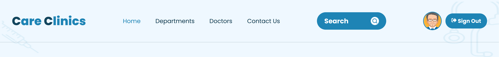

### Footer

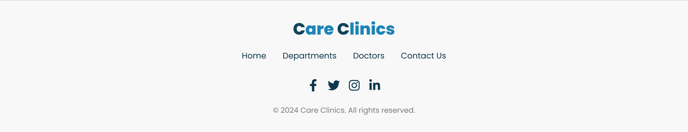

### Landing Page

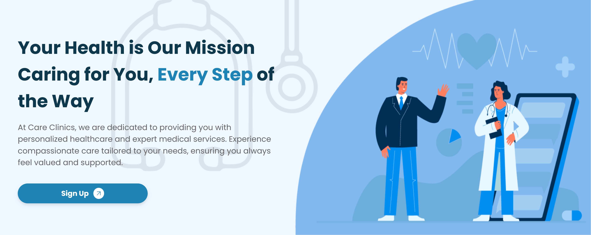

### Patient Home Page

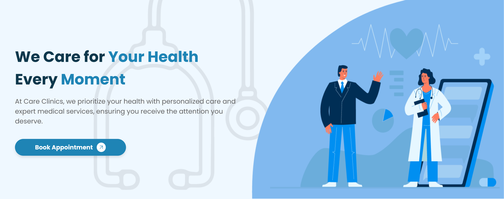

### Sign Up Page

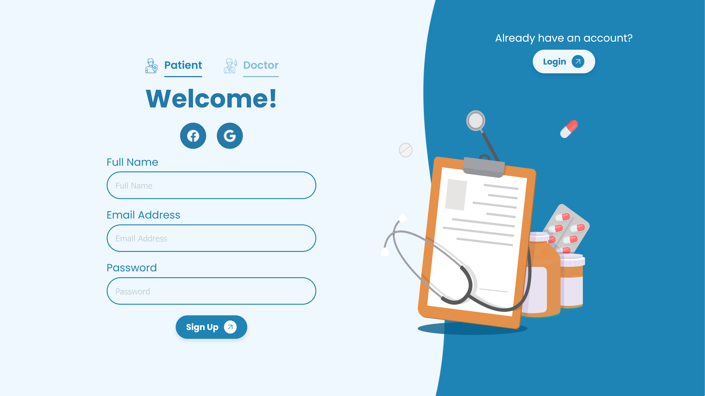

### Login Page

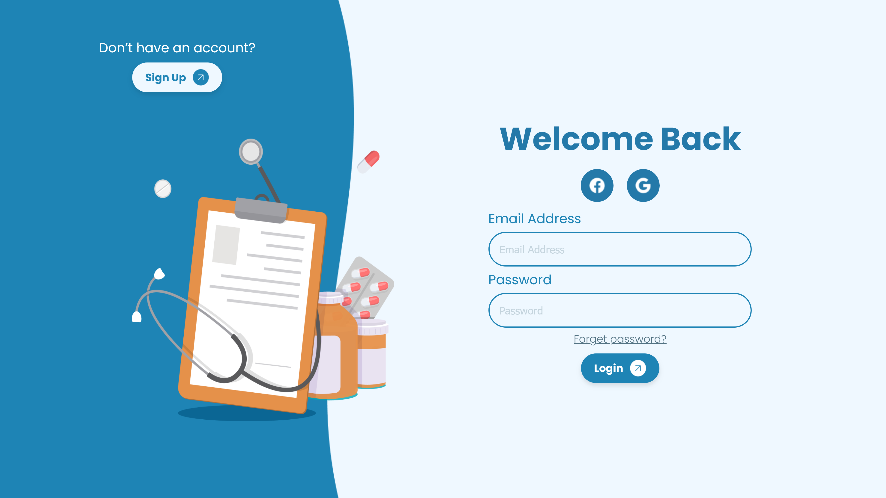

### Forget Password Page

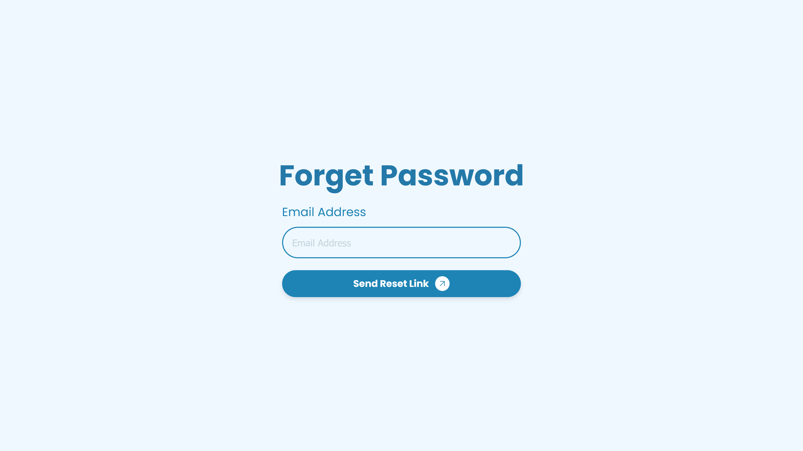

### Reset Password Page

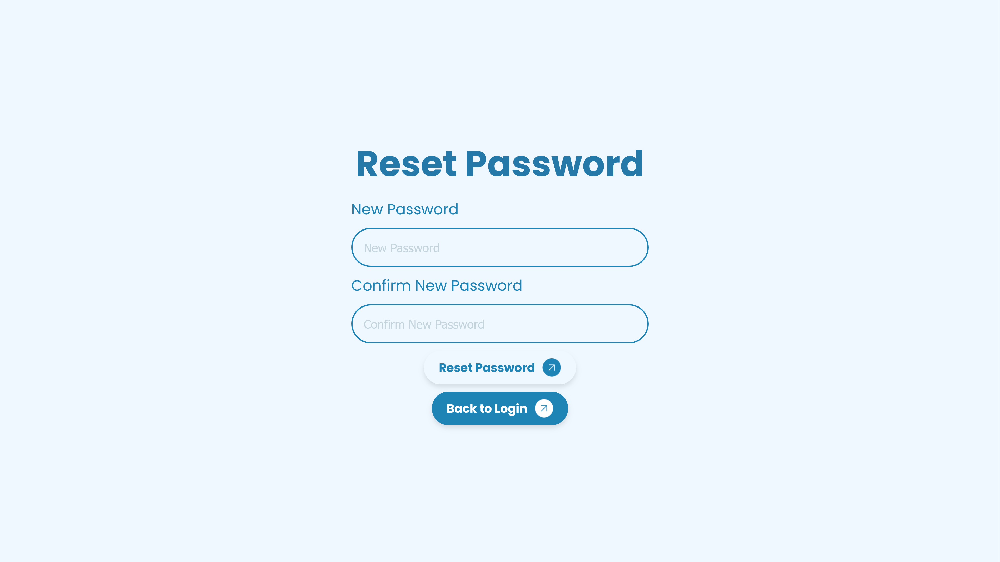

### Departments Page

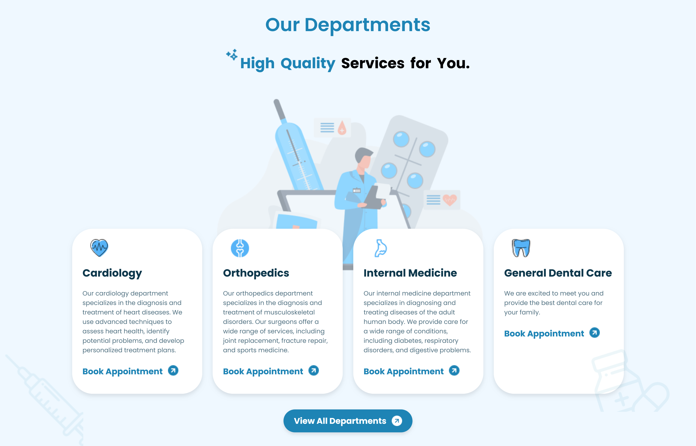

### Contact Us Page


### User Profile Page

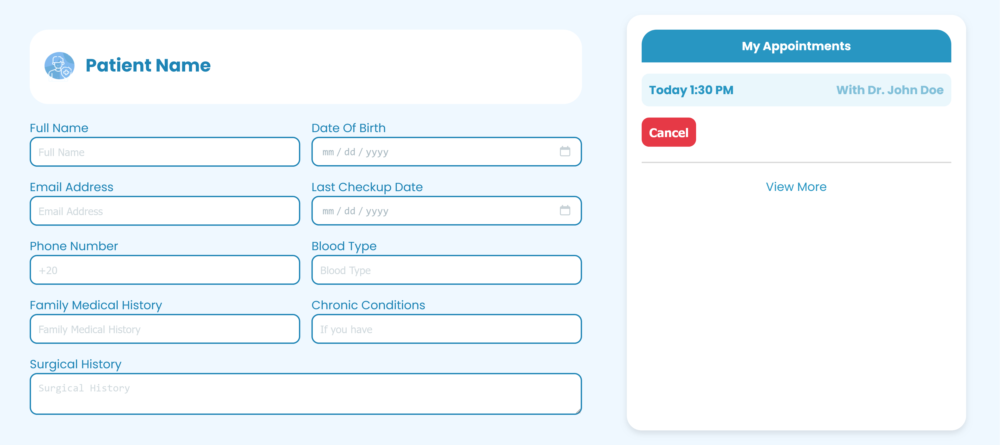

### Departments Dashboard

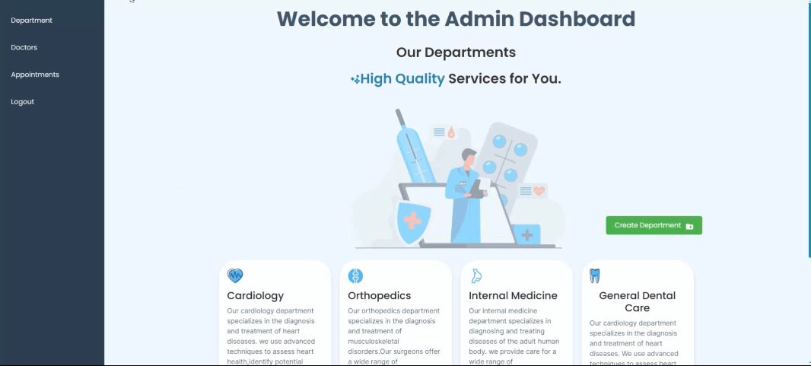

### Doctors Dashboard

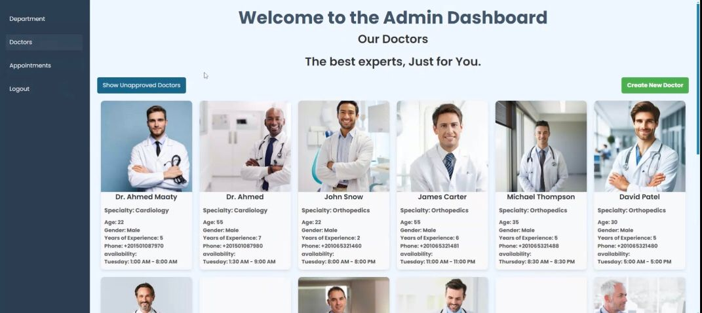

### Appointments Dashboard

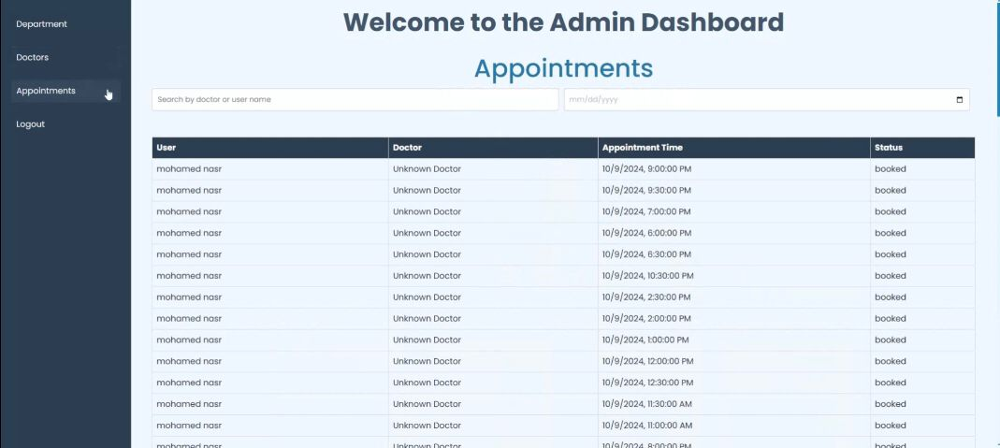

## Getting Started

### Prerequisites

- Node.js
- npm
- MongoDB
- Express
- React

### Installation

1. Clone the repository:
   ```bash
   git clone https://github.com/MoSalem149/care-clinics.git
   ```
